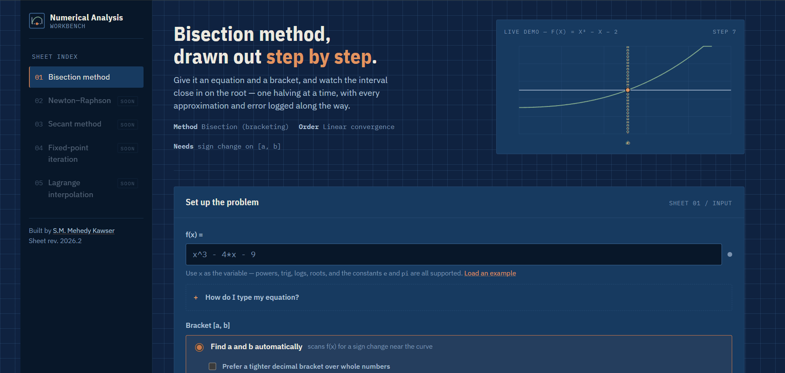
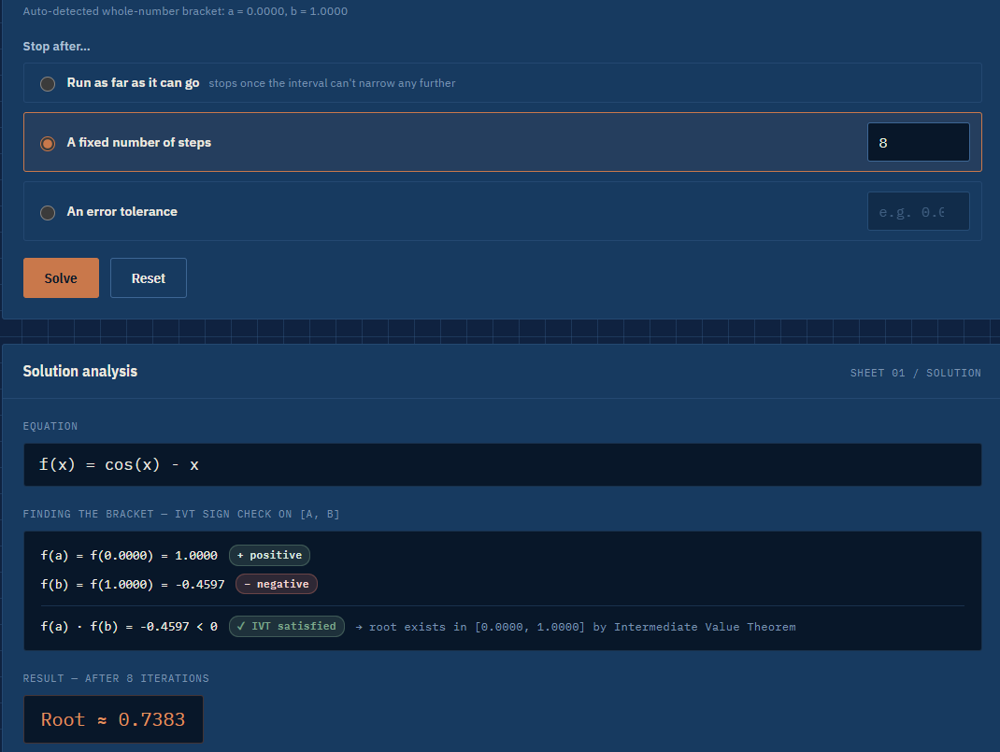
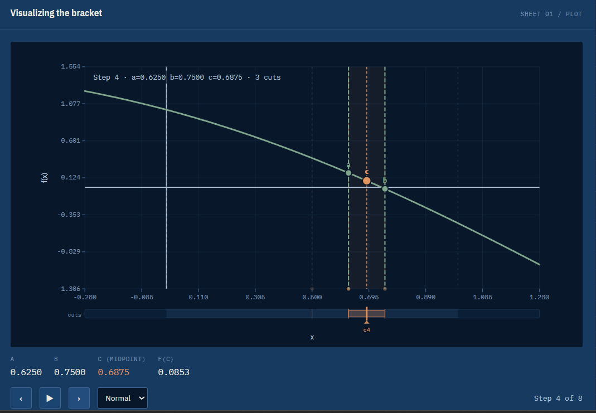
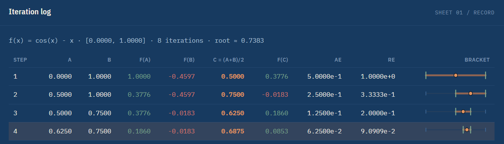
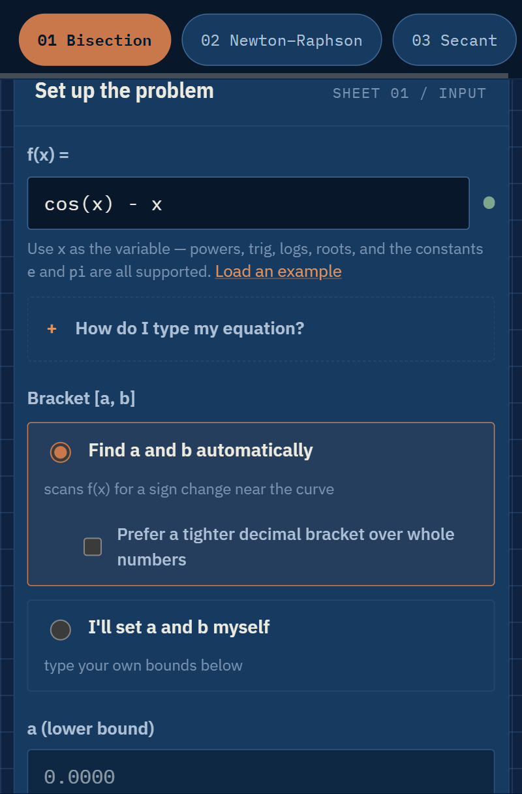
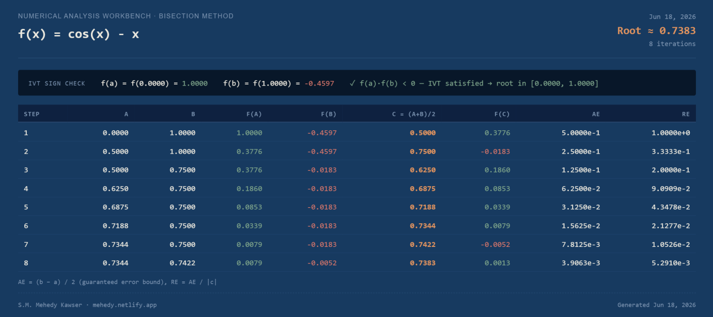

<div align="center">


<br/>


<br/><br/>

[](https://developer.mozilla.org/en-US/docs/Web/HTML)
[](https://developer.mozilla.org/en-US/docs/Web/JavaScript)
[](https://mathjs.org/)
[](#-mobile-ready)
[](#-getting-started)
[](#-security)
[](LICENSE)

<br/>

> **A beautiful, interactive, zero-dependency workbench for solving equations using the Bisection Method.**  
> Designed for Numerical Analysis students — type any equation, watch the algorithm converge in real time, and export a print-ready report in one tap.

<br/>

[](https://mehedyk.github.io/Numerical-Analysis/)

</div>

---

## 📸 Screenshots

<div align="center">

| Desktop View | Solution + IVT Check |
|:---:|:---:|
|  |  |

| Bisection Graph | Iteration Table |
|:---:|:---:|
|  |  |

| Mobile Portrait | Exported PDF |
|:---:|:---:|
|  |  |

</div>

---

## 📋 Table of Contents

- [✨ Features](#-features)
- [📐 How the Bisection Method Works](#-how-the-bisection-method-works)
- [🧮 Built-in Equation Examples](#-built-in-equation-examples)
- [⌨️ Equation Syntax Guide](#️-equation-syntax-guide)
- [🚀 Getting Started](#-getting-started)
- [📱 Mobile Ready](#-mobile-ready)
- [📥 Export Feature](#-export-feature)
- [🔒 Security](#-security)
- [🛠 Tech Stack](#-tech-stack)
- [📁 Project Structure](#-project-structure)
- [🙋 FAQ](#-faq)
- [📝 License](#-license)

---

## ✨ Features

<div align="center">

| 🔢 | Feature | Description |
|:---:|:---|:---|
| 🎯 | **Smart Auto-Bracket Detection** | Automatically scans **±1000** to find a valid `[a, b]` bracket where a sign change exists — works for positive and negative roots |
| ✍️ | **Natural Equation Input** | Type equations the way you write them: `xtan(x)-1`, `logx-cosx`, `3x^3-7x+5` — the smart preprocessor handles implicit multiplication and bare-function notation |
| 🎞️ | **Animated Bisection Graph** | Watch the bracket narrow in real time with a built-in step player — go forward, back, or let it play automatically |
| 📊 | **Full Iteration Table** | Every column: `n`, `a`, `b`, `f(a)`, `f(b)`, `c`, `f(c)`, Absolute Error, Relative Error |
| ✅ | **IVT Verification** | Automatically verifies the Intermediate Value Theorem condition `f(a)·f(b) < 0` before solving |
| 🛑 | **Flexible Stop Criteria** | Auto (IVT convergence), fixed iteration count, or custom tolerance — your choice |
| 🌍 | **True Root Mode** | Provide the known true root to get exact absolute and relative errors per iteration |
| 📥 | **One-Tap Export** | Download a full landscape PNG image or multi-page PDF — works perfectly on mobile too |
| 📱 | **Mobile-First Design** | 44px touch targets, stacked layouts, portrait-safe export — built for phones first |
| 🔐 | **Security Hardened** | CSP headers, XSS-safe rendering, input length limits, MIME validation, whitelisted radio values |
| 💡 | **10 Built-in Examples** | From simple cubics to transcendental equations — great for testing and learning |

</div>

---

## 📐 How the Bisection Method Works

The **Bisection Method** (also called the *binary search method* for roots) is a bracketing algorithm that repeatedly halves an interval until the root is isolated to within a desired tolerance.

### Prerequisites — The Intermediate Value Theorem

If $f$ is continuous on $[a, b]$ and $f(a) \cdot f(b) < 0$, then by the **IVT** there exists at least one root $c \in (a, b)$.

### Algorithm

```
Given: f(x), bracket [a, b] where f(a)·f(b) < 0

Repeat:
  1. c  ←  (a + b) / 2          ← midpoint
  2. if f(c) = 0 → root found!
  3. if f(a)·f(c) < 0 → b ← c   ← root in left half
  4. else            → a ← c    ← root in right half
  5. until |b - a| < ε  (or max iterations reached)
```

### Convergence

Each iteration **halves** the bracket, so after $n$ steps:

$$|c_n - r| \leq \frac{b - a}{2^n}$$

To guarantee $k$ correct decimal places, you need at least:

$$n \geq \frac{\log_{10}(b-a) - \log_{10}(\varepsilon)}{\log_{10}(2)} \approx 3.32 \cdot \log_{10}\!\left(\frac{b-a}{\varepsilon}\right) \text{ iterations}$$

### Worked Example — `cos(x) − x = 0`

| Step | a | b | c = (a+b)/2 | f(c) | New bracket |
|:---:|:---:|:---:|:---:|:---:|:---|
| 1 | 0.0000 | 1.0000 | **0.5000** | +0.3776 | [0.5, 1.0] |
| 2 | 0.5000 | 1.0000 | **0.7500** | −0.0183 | [0.5, 0.75] |
| 3 | 0.5000 | 0.7500 | **0.6250** | +0.1860 | [0.625, 0.75] |
| 4 | 0.6250 | 0.7500 | **0.6875** | +0.0838 | [0.6875, 0.75] |
| 5 | 0.6875 | 0.7500 | **0.7188** | +0.0327 | [0.7188, 0.75] |
| … | … | … | … | … | … |
| 20 | 0.7391 | 0.7391 | **0.7391** | ≈ 0 | ✅ Converged |

Root: $x \approx 0.7390851332$

---

## 🧮 Built-in Equation Examples

The app ships with **10 ready-to-solve equations** accessible from the Examples panel. Click any row to load it instantly.

<details>
<summary><b>📂 View All 10 Examples</b></summary>

<br/>

### 1 · Classic Cubic
$$f(x) = x^3 - x - 2 = 0$$
**Bracket:** $[1,\ 2]$ &nbsp;·&nbsp; **Root:** $x \approx 1.5214$

```
f(1) = -2  < 0
f(2) = +4  > 0  ✓ IVT satisfied
```

---

### 2 · Cubic — Two Positive Coefficients
$$f(x) = x^3 - 4x - 9 = 0$$
**Bracket:** $[2,\ 3]$ &nbsp;·&nbsp; **Root:** $x \approx 2.7065$

---

### 3 · Cubic with Negative Root ⭐ New
$$f(x) = 3x^3 - 7x + 5 = 0$$
**Bracket:** $[-2,\ -1]$ &nbsp;·&nbsp; **Root:** $x \approx -1.8340$

> Requires a **negative bracket** — the app now supports `a` and `b` with negative values.

```
f(−2) = −5  < 0
f(−1) = +9  > 0  ✓ IVT satisfied
```

---

### 4 · Transcendental (Trig)
$$f(x) = \cos(x) - x = 0$$
**Bracket:** $[0,\ 1]$ &nbsp;·&nbsp; **Root:** $x \approx 0.7391$ (the Dottie number)

---

### 5 · Exponential
$$f(x) = e^x - 3x = 0$$
**Bracket:** $[0,\ 1]$ &nbsp;·&nbsp; **Root:** $x \approx 0.6190$

---

### 6 · Square Root of 2
$$f(x) = x^2 - 2 = 0$$
**Bracket:** $[1,\ 2]$ &nbsp;·&nbsp; **Root:** $x \approx 1.4142 = \sqrt{2}$

> Classic benchmark — converges to $\sqrt{2}$ with no floating-point tricks.

---

### 7 · Sine
$$f(x) = \sin(x) - \tfrac{x}{2} = 0$$
**Bracket:** $[1,\ 2]$ &nbsp;·&nbsp; **Root:** $x \approx 1.8955$

---

### 8 · x · tan(x) ⭐ New
$$f(x) = x\tan(x) - 1 = 0$$
**Bracket:** $[0,\ 1]$ &nbsp;·&nbsp; **Root:** $x \approx 0.8603$

> You can type this as `xtan(x)-1` — the app auto-inserts the `*`.

---

### 9 · Log vs Cosine
$$f(x) = \log(x) - \cos(x) = 0$$
**Bracket:** $[1,\ 2]$ &nbsp;·&nbsp; **Root:** $x \approx 1.3026$

> Type as `logx-cosx` — the app expands bare-function notation automatically.

---

### 10 · Mixed Exponential
$$f(x) = e^x - x^2 - 2 = 0$$
**Bracket:** $[0,\ 1]$ &nbsp;·&nbsp; **Root:** $x \approx 0.4428$

> Uses the `e` constant: type `e^x - x^2 - 2`.

</details>

---

## ⌨️ Equation Syntax Guide

You can type equations naturally — the input parser handles many common shorthand notations automatically.

### Supported Notation

| Math | Type this | Notes |
|:---|:---|:---|
| $x^3$ | `x^3` | Power operator |
| $3x^2$ | `3x^2` or `3*x^2` | Implicit coefficient multiply |
| $\sqrt{x}$ | `sqrt(x)` | Square root |
| $e^x$ | `e^x` or `exp(x)` | Euler's number |
| $\ln(x)$ | `log(x)` or `ln(x)` | Natural log |
| $\log_{10}(x)$ | `log10(x)` | Base-10 log |
| $\sin(x)$ | `sin(x)` | Trig functions |
| $x\tan(x)$ | `x*tan(x)` or `xtan(x)` | ⭐ Implicit multiply before function |
| $\log(x)$ | `log(x)` or `logx` | ⭐ Bare-variable function shorthand |
| $\cos(x)$ | `cos(x)` or `cosx` | ⭐ Same for all trig / log functions |
| $\pi$ | `pi` | Pi constant |
| $e$ | `e` | Euler's number as constant |
| $|x|$ | `abs(x)` | Absolute value |

### ⭐ Smart Preprocessor — Examples

The app runs a two-step preprocessor before evaluating, so these all work:

```
Input            →  Parsed as
─────────────────────────────────
xtan(x)-1        →  x*tan(x)-1
2sin(x)+cos(x)   →  2*sin(x)+cos(x)
logx-cosx        →  log(x)-cos(x)
sinx^2           →  sin(x)^2
log10x           →  log10(x)
3x^3-7x+5        →  3*x^3-7*x+5   (mathjs implicit multiply)
```

### Bounds (a and b)

Bounds accept the same math expressions:

```
pi        →  3.14159…
2*pi      →  6.28318…
sqrt(2)   →  1.41421…
e         →  2.71828…
-2        →  −2  (negative bounds fully supported ✓)
```

---

## 🚀 Getting Started

### How to Use the App

```
Step 1 ── Enter f(x)
          Type your equation, e.g.  cos(x) - x
          The validation dot turns green when the syntax is valid ●

Step 2 ── Choose bracket mode
          ○ Auto-detect       → the app scans ±1000 for a sign change
          ○ Set a and b myself → type your own bounds (decimals, pi, -2, etc.)

Step 3 ── Set stop criterion (optional)
          ○ Auto              → stops when bracket width < 1×10⁻¹⁰
          ○ Iterations        → exactly N steps
          ○ Tolerance ε       → stops when |b-a| < ε

Step 4 ── Click SOLVE
          The IVT check, full iteration table, and graph all appear instantly.

Step 5 ── Animate (optional)
          Use ◀ ▶ buttons or ▷ Play to step through the algorithm visually.

Step 6 ── Export
          Tap "Download as image" or "Download as PDF" for a landscape report.
```

---

## 📱 Mobile Ready

The app is designed with **mobile-first** principles:

<div align="center">

</div>

<br/>

- **44px minimum touch targets** on all interactive elements (WCAG 2.5.5)
- **Stacked export buttons** — full-width, easy to tap
- **IVT rows collapse** vertically so nothing overflows on narrow screens
- **2-column reading grid** instead of a long horizontal strip
- **Hero diagram hidden** on very small phones to save space
- **Mobile navigation bar** for jumping between app sections
- **Touch-friendly table** — scrolls horizontally with momentum

### Export on Mobile

On a phone, the iteration table is clipped inside a scroll container. Standard screen-capture approaches would produce a narrow portrait image missing most columns.

**This app solves that** by building a dedicated **off-screen 1120px landscape panel** at capture time — the exported PNG/PDF is always full landscape with every column visible, regardless of what your device screen size is.

---

## 📥 Export Feature

After solving, tap either export button to download a complete, print-ready report.

<div align="center">

</div>

<br/>

The exported file includes:

| Section | Content |
|:---|:---|
| **Header** | Equation, date, root approximation, iteration count, stop reason |
| **IVT Banner** | `f(a)` and `f(b)` values, sign check confirmation |
| **Iteration Table** | All columns: `n`, `a`, `b`, `f(a)`, `f(b)`, `c`, `f(c)`, AE, RE |
| **Footer Note** | Error formula used (bound or true root) |
| **Credit Line** | Author + generation date |

**PNG** — Landscape, 2× scale (retina quality), `~1120×auto px`  
**PDF** — Landscape A4, auto multi-page if the table is very long

---

## 🔒 Security

This is a client-side math tool. No data is ever sent to any server. The following hardening has been applied:

| Layer | Implementation |
|:---|:---|
| **Content Security Policy** | `<meta http-equiv="Content-Security-Policy">` — blocks scripts/frames from unknown origins |
| **X-Content-Type-Options** | `nosniff` — prevents MIME-type sniffing attacks |
| **Referrer Policy** | `no-referrer` — no URL leakage on external links |
| **XSS Prevention** | All user-supplied strings are passed through `escHtml()` before any `innerHTML` insertion. Escapes `&`, `<`, `>`, `"`, `'` |
| **Input Length Limits** | f(x) capped at 500 characters; bound expressions capped at 200 characters — prevents ReDoS on the regex preprocessor |
| **Radio Button Whitelisting** | `bracketMode` and `stopMode` values are checked against explicit allowlists before use — cannot be injected |
| **parseVal Guard** | Strings over 200 chars are rejected before reaching `math.evaluate()` |
| **Download MIME Validation** | `dl()` validates blob type is `image/png` or `application/pdf` before creating the anchor |
| **Filename Sanitisation** | Downloaded filenames are stripped of unsafe characters via regex |
| **SQL Injection** | Not applicable — this is a fully client-side application with no database or backend |
| **Sandboxed Math Eval** | All expression evaluation is done via [Math.js](https://mathjs.org/) which provides its own sandboxed parser — `eval()` is never called on user input |

---

## 🛠 Tech Stack

| Library | Version | Purpose |
|:---|:---:|:---|
| [Math.js](https://mathjs.org/) | 13.x | Expression parsing & sandboxed evaluation |
| [html2canvas](https://html2canvas.hertzen.com/) | 1.4.1 | DOM → Canvas for image export |
| [jsPDF](https://github.com/parallax/jsPDF) | 2.5.1 | Canvas → PDF export |
| [IBM Plex Sans / Mono](https://fonts.google.com/specimen/IBM+Plex+Mono) | — | Typography (Google Fonts) |

**Zero build tooling.** No Webpack, Vite, Rollup, npm, or Node.js required. All libraries are loaded from [cdnjs.cloudflare.com](https://cdnjs.cloudflare.com/).

---

## 📁 Project Structure

```
numerical-analysis-workbench/
│
├── index.html                  ← The entire application (HTML + CSS + JS, one file)
│
└── assets/
    ├── banner.svg              ← Animated README banner
    └── screenshots/
        ├── 01-desktop-full.png
        ├── 02-solution-ivt.png
        ├── 03-graph-step4.png
        ├── 04-iteration-table.png
        ├── 05-mobile.png
        └── 06-export-pdf.png
```

The entire app is **one self-contained HTML file** (`index.html`, ~80 KB). Everything — markup, styles, and logic — lives in that single file. Drop it anywhere and it runs.

---

## 🙋 FAQ

<details>
<summary><b>Why does my equation show a red dot?</b></summary>
<br/>
The validation dot turns red when Math.js cannot parse the expression. Common fixes:

- Use `*` for multiplication: `2*x` not `2 x` (space alone won't work)
- Use `^` for powers: `x^3` not `x³`
- Functions need parentheses: `sin(x)` not `sin x` — or use the shorthand `sinx`
- Division: `x/2` not `x÷2`
</details>

<details>
<summary><b>Why does auto-detect sometimes not find a bracket?</b></summary>
<br/>
The scanner checks whole-number steps from −1000 to +1000, then finer intervals. It will fail if:

1. The function has **no real roots** in that range
2. The root is at a **discontinuity** (e.g. `tan(x)` has sign changes at asymptotes that look like roots)
3. The function requires a **very small bracket** that the whole-number scan skips over

Switch to **"I'll set a and b myself"** and enter bounds you know contain a root.
</details>

<details>
<summary><b>Can I use negative values for a and b?</b></summary>
<br/>
Yes! Negative bounds are fully supported in manual mode. Just type `-2` for `a` and `-1` for `b`. The example `3x^3 - 7x + 5` uses `[-2, -1]` because its only real root is ≈ −1.834.
</details>

<details>
<summary><b>What's the difference between AE and RE in the table?</b></summary>
<br/>

- **AE (Absolute Error):** If you provided a true root → `|c − true_root|`. Otherwise → `(b − a) / 2` (the guaranteed error bound from the bracket width).
- **RE (Relative Error):** `AE / |c|` — gives the error as a fraction of the approximation.
</details>

<details>
<summary><b>The export looks different on my phone vs desktop — is that normal?</b></summary>
<br/>
The app UI adapts for mobile screens. However, the <b>exported file is always identical</b> — it's rendered from a dedicated off-screen 1120px landscape panel, not a screenshot of what you see on screen. So the PDF/PNG will always contain every column in landscape format regardless of your device.
</details>

<details>
<summary><b>Can I host this on my own domain?</b></summary>
<br/>
Absolutely. Just upload `index.html` to any static host:

- GitHub Pages (free)
- Netlify (free, drag-and-drop)
- Vercel (free)
- Any shared hosting with FTP access
</details>

---

## 📊 Algorithm Complexity

| Property | Value |
|:---|:---|
| **Convergence** | Linear — guaranteed |
| **Error after n steps** | $\leq (b-a) / 2^n$ |
| **Steps for 6 decimal places** | $\approx 20$ iterations (starting from bracket width 1) |
| **Steps for 10 decimal places** | $\approx 34$ iterations |
| **Failure conditions** | f not continuous on [a,b], or f(a)·f(b) ≥ 0 |
| **Compared to Newton-Raphson** | Slower but always converges; no derivative needed |

---

## 🤝 Contributing

Contributions are welcome! Here's how:

```bash
# 1. Fork and clone
git clone https://github.com/mehedyk/Numerical-Analysis.git

# 2. Create a feature branch
git checkout -b feature/my-new-method

# 3. Make your changes to index.html

# 4. Test by opening index.html in a browser (no build needed)

# 5. Submit a pull request
```

### Ideas for Contributions

- [ ] Add other root-finding methods (False Position, Newton-Raphson, Secant)
- [ ] Dark/light theme toggle
- [ ] Share-by-URL (encode equation in URL hash)
- [ ] Copy table as LaTeX / CSV
- [ ] Complex root detection warning
- [ ] Bangla language support 🇧🇩

---

## 📝 License

```
MIT License

Copyright (c) 2026 S.M. Mehedy Kawser

Permission is hereby granted, free of charge, to any person obtaining a copy
of this software and associated documentation files (the "Software"), to deal
in the Software without restriction, including without limitation the rights
to use, copy, modify, merge, publish, distribute, sublicense, and/or sell
copies of the Software, and to permit persons to whom the Software is
furnished to do so, subject to the following conditions:

The above copyright notice and this permission notice shall be included in
all copies or substantial portions of the Software.
```

---

<div align="center">


<br/><br/>

[](https://github.com/mehedyk/Numerical-Analysis/stargazers)
[](https://github.com/mehedyk/Numerical-Analysis/network/members)

<br/>

*If this helped you pass your Numerical Analysis exam — leave a ⭐*

</div>